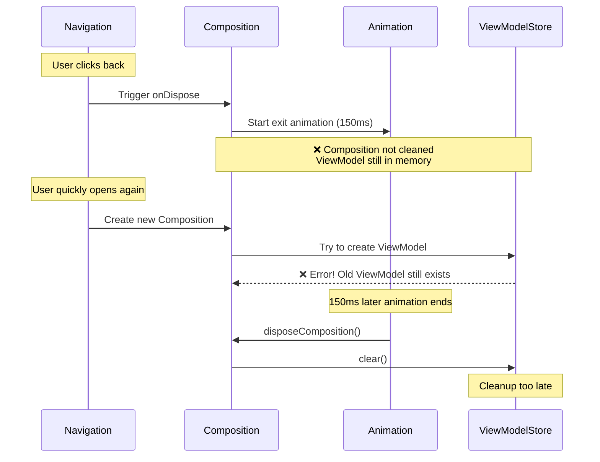
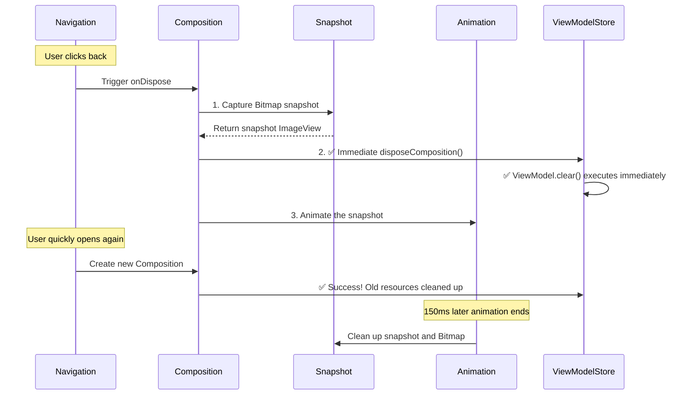
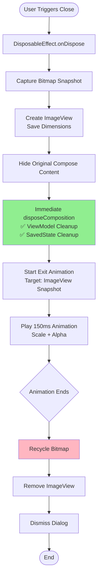

# Building a High-Performance Compose BottomSheet Dialog: From Problems to Solutions

## Table of Contents
- [Background and Motivation](#background-and-motivation)
- [Design Goals](#design-goals)
- [Implementation Process](#implementation-process)
    - [Basic Implementation](#basic-implementation)
    - [Core Problems and Solutions](#core-problems-and-solutions)
    - [Optimization Considerations](#optimization-considerations)
- [Final Solution](#final-solution)
- [Usage Examples](#usage-examples)
- [Summary and Reflections](#summary-and-reflections)

---

## Demo

<video src="https://github.com/user-attachments/assets/c7c53877-7974-4981-a2dc-ac2939a07e28"
controls="controls" width="800">
</video>

---

## Background and Motivation

When developing Jetpack Compose applications, we frequently need to use Bottom Sheets to display additional information or interaction options. While Compose provides some ready-made solutions, we've found they all have limitations in real-world projects.

### Why Not Use Existing Solutions Directly?

#### 1. Limitations of Dialog
The standard `Dialog` component lacks the visual effects and interaction experience specific to bottom sheets, requiring extensive customization to achieve the bottom slide-up effect.

#### 2. Problems with ModalBottomSheet

`ModalBottomSheet` is the official bottom sheet component provided by Material3, but it has the following pain points in actual use:

**a) Complex API Usage**

Each use requires `SheetState` and `CoroutineScope`:

```kotlin
val sheetState = rememberModalBottomSheetState()
val scope = rememberCoroutineScope()
var showBottomSheet by remember { mutableStateOf(false) }

// Show
showBottomSheet = true

// Hide: need to call hide() first, then change state
scope.launch {
    sheetState.hide()
}.invokeOnCompletion {
    if (!sheetState.isVisible) {
        showBottomSheet = false
    }
}
```

This boilerplate code permeates the entire project, increasing maintenance costs.

**b) Animation Effects Don't Match Requirements**

`ModalBottomSheet`'s default animation is:
- **Background**: Fade in/out
- **Content**: Slide up from bottom

But our design requirements are:
- **Background**: Fade in/out
- **Content**: Slide up from bottom + **Scale with bottom as pivot** (80% → 100%)

Implementing custom animation effects requires deep customization with high complexity.

**c) Need for Simplified Usage**

We want to use it as simply as `Dialog`:

```kotlin
// Ideal API
if (showDialog) {
    BottomSheet(
        onDismissRequest = { showDialog = false }
    ) {
        // content
    }
}
```

When `showDialog` becomes `false`, the BottomSheet automatically plays the exit animation and closes without manual state management.

### Why Implement Based on ComponentDialog?

Based on the above analysis, we decided to implement a custom BottomSheet on top of `ComponentDialog`:

1. **Independent of Compose's Animation System**: Use Android native animation APIs for complete control over animation effects
2. **Simplified API**: Declarative usage similar to `Dialog`, no extra state management needed
3. **Complete Lifecycle Control**: Better management of resources and animation timing
4. **Flexible Customization**: Can implement any desired visual effects

---

## Design Goals

Based on the above background, we set the following design goals:

### 1. Clean API
- Declarative usage, similar to `Dialog`
- No need to manually manage `SheetState` and `CoroutineScope`
- One line of code for show/hide

### 2. Smooth Animation Effects
- **Enter animation**: Background fade in + content scale up from bottom (0.8 → 1.0)
- **Exit animation**: Background fade out + content scale down (1.0 → 0.8)
- Animation duration: 150ms
- Scale pivot: Bottom center point

### 3. Proper Resource Management
- Timely ViewModel cleanup
- Proper SavedStateHandle release
- Avoid memory leaks
- Support as Navigation Destination

### 4. Good User Experience
- Close by clicking outside
- Close with back button
- Support system bars adaptation
- Support keyboard input

---

## Implementation Process

### Basic Implementation

First, we built the basic BottomSheet structure based on `ComponentDialog`:

```kotlin
@Composable
fun BottomSheet(
    onDismissRequest: () -> Unit,
    shape: Shape = RoundedCornerShape(topStart = 28.dp, topEnd = 28.dp),
    containerColor: Color = MaterialTheme.colorScheme.surface,
    content: @Composable () -> Unit
) {
    val view = LocalView.current
    val density = LocalDensity.current
    val composition = rememberCompositionContext()
    
    val dialog = remember(view, density) {
        BottomSheetWrapper(
            onDismissRequest = onDismissRequest,
            composeView = view,
            density = density
        ).apply {
            setContent(composition) {
                Surface(
                    shape = shape,
                    color = containerColor
                ) {
                    content()
                }
            }
        }
    }
    
    DisposableEffect(dialog) {
        dialog.show()
        onDispose {
            dialog.dismiss()
        }
    }
}
```

In `BottomSheetWrapper`, we implement custom enter and exit animations:

```kotlin
private fun startEnterAnim() {
    dialogLayout.pivotX = dialogLayout.width / 2F
    dialogLayout.pivotY = dialogLayout.height.toFloat()
    
    dialogLayout.scaleX = SCALE_START  // 0.8
    dialogLayout.scaleY = SCALE_START
    dialogLayout.alpha = ALPHA_START   // 0.0
    
    val backgroundAnim = ValueAnimator.ofObject(
        ArgbEvaluator(),
        android.graphics.Color.TRANSPARENT,
        COLOR_SCRIM
    ).apply {
        addUpdateListener { animator -> 
            container.setBackgroundColor(animator.animatedValue as Int) 
        }
    }
    
    val contentScaleXAnim = ObjectAnimator.ofFloat(dialogLayout, "scaleX", SCALE_START, 1F)
    val contentScaleYAnim = ObjectAnimator.ofFloat(dialogLayout, "scaleY", SCALE_START, 1F)
    val contentAlphaAnim = ObjectAnimator.ofFloat(dialogLayout, "alpha", ALPHA_START, 1F)
    
    AnimatorSet().apply {
        playTogether(backgroundAnim, contentScaleXAnim, contentScaleYAnim, contentAlphaAnim)
        duration = DURATION_ANIMATION  // 150ms
        start()
    }
}
```

The exit animation is similar, just in reverse direction.

### Core Problems and Solutions

During implementation, we encountered several key problems. Below is a detailed analysis of each problem's cause and solution.

---

#### Problem 1: Resource Cleanup Conflict with Navigation3 Integration

**Problem Manifestation**

When using BottomSheet as a Navigation Destination, if `viewModel()` is used inside the BottomSheet to obtain a ViewModel, crashes occur when quickly closing and reopening:

```
java.lang.IllegalArgumentException: Key XXX was used multiple times
    at androidx.compose.runtime.saveable.SaveableStateHolderImpl.SaveableStateProvider
```

**Root Cause**

Let's understand the essence of the problem through a sequence diagram:



**Original Implementation (Problematic):**

```kotlin
DisposableEffect(dialog) {
    dialog.show()
    
    onDispose {
        dialog.dismissWithExitAnim()  // Start animation
        // ❌ disposeComposition() will only be called after animation ends
    }
}

private fun dismissWithExitAnim() {
    // Play 150ms animation
    AnimatorSet().apply {
        // ...
        addListener(
            onEnd = {
                dismiss()
                dialogLayout.disposeComposition()  // ❌ Too late!
            }
        )
        start()
    }
}
```

**Problem Analysis:**

1. When Navigation triggers `onDispose`, it decides to remove this Destination
2. We start the exit animation (150ms)
3. **Key issue**: `disposeComposition()` waits until animation ends
4. During these 150ms, if user opens again:
    - Navigation creates a new Composition instance
    - But old ViewModel and SavedStateHandle aren't cleaned up yet
    - `SaveableStateHolder` detects duplicate key and throws exception

**Failed Attempt: Immediate Disposal**

```kotlin
onDispose {
    dialogLayout.disposeComposition()  // ❌ Immediate cleanup
    dialog.dismissWithExitAnim()       // Play animation
}
```

This causes another problem:
- Composition is immediately cleaned up
- Animation target (`dialogLayout`) content disappears
- User only sees blank area scaling
- Poor experience

**Solution: Bitmap Snapshot Technique**

We adopted a clever solution: capture a visual snapshot before cleaning up Composition, then animate the snapshot.



**Final Implementation:**

```kotlin
DisposableEffect(dialog) {
    dialog.show()
    
    onDispose {
        // 1. Capture snapshot and immediately dispose composition
        dialog.captureSnapshotAndDispose()
        // 2. Animate the snapshot
        dialog.dismissWithExitAnim()
    }
}

fun captureSnapshotAndDispose() {
    try {
        if (dialogLayout.width > 0 && dialogLayout.height > 0) {
            // Capture current visual state
            val bitmap = dialogLayout.drawToBitmap(config = Bitmap.Config.RGB_565)
            
            // Create ImageView to display snapshot
            snapshotImageView = ImageView(context).apply {
                setImageBitmap(bitmap)
                layoutParams = FrameLayout.LayoutParams(
                    dialogLayout.width,
                    dialogLayout.height
                ).apply {
                    gravity = android.view.Gravity.BOTTOM
                }
                // Set scale pivot point
                pivotX = width / 2F
                pivotY = height.toFloat()
            }
            
            // Hide original content, show snapshot
            dialogLayout.visibility = View.GONE
            container.addView(snapshotImageView)
        }
        
        // ✅ Immediately dispose composition
        dialogLayout.disposeComposition()
    } catch (e: Exception) {
        // Clean up resources even if snapshot fails
        dialogLayout.disposeComposition()
    }
}

fun dismissWithExitAnim() {
    // Use snapshot for animation if available, otherwise use original view
    val animationTarget = snapshotImageView ?: dialogLayout
    
    // Set animation parameters and play...
    AnimatorSet().apply {
        // ...
        addListener(
            onEnd = {
                cleanupSnapshot()  // Clean up snapshot
                dismiss()          // Dismiss dialog
            }
        )
        start()
    }
}
```

**Solution Advantages:**

1. ✅ **Immediate resource cleanup**: ViewModel and SavedState released immediately on `onDispose`
2. ✅ **Complete animation effects**: User still sees smooth exit animation
3. ✅ **Navigation compatible**: Perfect support as Destination
4. ✅ **Memory safe**: Bitmap only exists for 150ms, timely recycling

**Trade-off Explanation:**

Although Bitmap snapshot uses extra memory (see optimization analysis later), its lifecycle is extremely short (only 150ms) and perfectly solves the resource cleanup problem - a worthwhile trade-off.

---

#### Problem 2: ImageView Pivot Calculation Issue

After implementing the Bitmap snapshot solution, we discovered a new problem: the animation's scale center point was incorrect - ImageView scaled from top-left instead of bottom center.

**Problem Analysis**

```kotlin
// Create ImageView and add to container
snapshotImageView = ImageView(context).apply {
    setImageBitmap(bitmap)
    layoutParams = FrameLayout.LayoutParams(width, height)
}
container.addView(snapshotImageView)

// Start animation immediately
dismissWithExitAnim()

fun dismissWithExitAnim() {
    val animationTarget = snapshotImageView!!
    // ❌ ImageView hasn't completed layout measurement yet
    animationTarget.pivotX = animationTarget.width / 2F  // width = 0
    animationTarget.pivotY = animationTarget.height.toFloat()  // height = 0
}
```

As shown in logs:
```
captureSnapshotAndDispose: dialogLayout size = 1344 x 997
captureSnapshotAndDispose: ImageView pivot set to (672.0, 997.0)
dismissWithExitAnim: animationTarget size = 0 x 0  // ❌ Layout not completed
dismissWithExitAnim: pivot after = (0.0, 0.0)     // ❌ Calculation error
```

**Reason:**
- ImageView just added to container
- Android's layout system is asynchronous
- Reading `width/height` immediately after `addView()` returns 0
- Pivot calculated based on 0 is also (0, 0)

**Solution: Save Dimension Info**

```kotlin
private var snapshotWidth: Int = 0
private var snapshotHeight: Int = 0

fun captureSnapshotAndDispose() {
    val width = dialogLayout.width
    val height = dialogLayout.height
    
    // Save dimensions for later use
    snapshotWidth = width
    snapshotHeight = height
    
    snapshotImageView = ImageView(context).apply {
        // Set pivot once during creation (View's width/height are still correct at this point)
        pivotX = width / 2F
        pivotY = height.toFloat()
    }
    
    container.addView(snapshotImageView)
}

fun dismissWithExitAnim() {
    val animationTarget = snapshotImageView ?: dialogLayout
    
    // Use saved dimensions instead of measured values
    val targetWidth = if (snapshotImageView != null && snapshotWidth > 0) {
        snapshotWidth
    } else {
        animationTarget.width
    }
    val targetHeight = if (snapshotImageView != null && snapshotHeight > 0) {
        snapshotHeight
    } else {
        animationTarget.height
    }
    
    // ✅ Calculate pivot using saved dimensions
    animationTarget.pivotX = targetWidth / 2F
    animationTarget.pivotY = targetHeight.toFloat()
}
```

Fixed log output:
```
captureSnapshotAndDispose: dialogLayout size = 1344 x 997
dismissWithExitAnim: using dimensions = 1344 x 997  // ✅ Using saved dimensions
dismissWithExitAnim: pivot after = (672.0, 997.0)   // ✅ Correct
```

---

#### Problem 3: Rapid Background Clicking Causes Multiple Dismiss Triggers

When implementing the click-outside-to-dismiss functionality, we discovered an interaction issue: rapid clicking on the background can cause `onDismissRequest()` to be called multiple times.

**Problem Manifestation**

When user rapidly clicks the area outside BottomSheet:

1. First click triggers `onDismissRequest()`, starting exit animation
2. During the 150ms animation, Dialog is still visible
3. If user clicks outside again, it triggers `onDismissRequest()` again
4. Results in multiple callbacks, potentially causing state management chaos

**Root Cause**

```kotlin
setOnTouchListener { _, event ->
    var result = false
    if (properties.dismissOnClickOutside && !dialogLayout.isInsideContent(event)) {
        when (event.actionMasked) {
            MotionEvent.ACTION_UP ->
                if (isPressOutside) {
                    // ❌ No check if already dismissing
                    onDismissRequest()  // May be called multiple times
                    result = true
                    isPressOutside = false
                }
        }
    }
    result
}
```

**Solution: Add isDismissing Flag**

Introduce a state flag to track whether Dialog is in the dismissing process:

```kotlin
private var isDismissing = false

setOnTouchListener { _, event ->
    var result = false
    // Ignore touch events if dismiss is already in progress
    if (isDismissing) {
        return@setOnTouchListener false
    }
    
    if (properties.dismissOnClickOutside && !dialogLayout.isInsideContent(event)) {
        when (event.actionMasked) {
            MotionEvent.ACTION_DOWN -> {
                isPressOutside = true
                result = true
            }

            MotionEvent.ACTION_UP ->
                if (isPressOutside) {
                    isDismissing = true  // ✅ Mark as dismissing
                    onDismissRequest()
                    result = true
                    isPressOutside = false
                }

            MotionEvent.ACTION_CANCEL -> isPressOutside = false
        }
    }
    result
}
```

Also check this flag in back button handling:

```kotlin
onBackPressedDispatcher.addCallback(this) {
    if (properties.dismissOnBackPress && !isDismissing) {
        isDismissing = true
        onDismissRequest()
    }
}
```

And in the `onKeyUp` method:

```kotlin
override fun onKeyUp(keyCode: Int, event: KeyEvent): Boolean {
    if (
        properties.dismissOnBackPress &&
        event.isTracking &&
        !event.isCanceled &&
        keyCode == KeyEvent.KEYCODE_ESCAPE &&
        !isDismissing
    ) {
        isDismissing = true
        onDismissRequest()
        return true
    }
    return super.onKeyUp(keyCode, event)
}
```

Finally, reset the flag when animation ends (in case animation is cancelled and needs retry):

```kotlin
fun dismissWithExitAnim() {
    // ... animation setup code
    
    AnimatorSet().apply {
        playTogether(backgroundAnim, scaleXAnim, scaleYAnim, alphaAnim)
        duration = 150L
        addListener(
            onEnd = {
                currentAnimator = null
                isDismissing = false  // ✅ Reset flag
                cleanupSnapshot()
                dismiss()
            },
            onCancel = {
                currentAnimator = null
                isDismissing = false  // ✅ Reset on cancel too
                cleanupSnapshot()
                dismiss()
            }
        )
        start()
    }
}
```

**Solution Advantages:**

1. ✅ **Prevent duplicate calls**: Ensures `onDismissRequest()` is only called once during dismissal
2. ✅ **Unified state management**: All dismiss entry points (click outside, back button, ESC key) check the same flag
3. ✅ **Improved user experience**: Avoids abnormal behavior from rapid clicks
4. ✅ **Simple and efficient**: Single boolean flag, no performance overhead

---

### Optimization Considerations

#### Bitmap Format Selection: RGB_565 vs ARGB_8888

When implementing the snapshot functionality, we need to choose the appropriate Bitmap format.

**Format Comparison:**

| Format | Bytes per Pixel | Features | Memory Usage (1344×997) |
|--------|----------------|----------|------------------------|
| RGB_565 | 2 bytes | No alpha channel | **2.55 MB** |
| ARGB_8888 | 4 bytes | Full alpha channel | **5.1 MB** |

**A Common Misconception:**

> "BottomSheet has rounded corners, needs alpha support, so must use ARGB_8888"

**Reality:**

1. **How Rounded Corners Work**:
    - Compose's rounded corners are implemented via `Canvas.clipPath()`
    - Clipping content outside rounded area during drawing
    - `drawToBitmap()` captures the **final rendered result**
    - Rounded corners are already properly handled during capture

2. **How Alpha Animation Works**:
    - The alpha change we need is for the entire View
    - Implemented via `ImageView.alpha` property
    - Bitmap itself doesn't need to support alpha channel

3. **Handling Semi-transparent Content**:
    - If BottomSheet content has semi-transparent elements
    - `drawToBitmap()` will blend them with background
    - RGB_565 saves the final blended colors
    - Visual effect is identical

**Conclusion: Use RGB_565**

```kotlin
val bitmap = dialogLayout.drawToBitmap(config = Bitmap.Config.RGB_565)
```

**Advantages:**
- Save **50%** memory (2.55 MB vs 5.1 MB)
- No visual difference
- Same animation smoothness

---

#### Do We Need a Bitmap Memory Pool?

Considering Bitmap memory usage, we evaluated whether implementing a memory pool to reuse Bitmaps is necessary.

**Typical scenarios for memory pools:**
- High frequency creation/destruction
- Fixed or predictable size
- Long lifecycle
- High memory pressure

**Our Scenario Analysis:**

| Dimension | Memory Pool Need | Actual Situation |
|-----------|-----------------|------------------|
| **Frequency** | High frequency | ❌ BottomSheet not frequent, usually seconds apart |
| **Lifecycle** | Long-term hold | ❌ Only 150ms, recycled after animation |
| **Size** | Fixed predictable | ❌ Different content = different sizes, hard to pre-allocate |
| **Memory Pressure** | High peak | ✅ Peak 2.55MB, but very short duration |

**Cost Comparison:**

```
Current approach:
- Peak memory: 2.55 MB
- Duration: 150 ms
- Management cost: 0 (automatic GC)

Memory pool approach:
- Resident memory: ~7.5 MB (pre-allocate 3 different sizes)
- Management code: ~500 lines
- Complexity: High (size matching, expiration cleanup, etc.)
```

**Android optimizations:**
- Bitmap memory allocated in Native Heap
- Does not occupy Java Heap
- Low GC pressure
- Automatic system management

**Conclusion: Memory pool not needed**

Reasons:
1. Lifecycle too short (150ms)
2. Low frequency, low memory pressure
3. Variable size, low reuse rate
4. High implementation complexity, low benefit
5. Android already has optimizations

**Actual performance data:**

Tested on Pixel 8 Pro:
- Bitmap creation time: 8-12ms
- Memory peak: 2.55MB
- Recycle time: < 1ms
- No impact on animation smoothness

---

## Final Solution

After solving the above problems and optimizations, we arrived at our final implementation.

### Core Flow



### Key Code Implementation

#### 1. Composable Function

```kotlin
@Composable
fun BottomSheet(
    onDismissRequest: () -> Unit,
    shape: Shape = BottomSheetDefaults.ExpandedShape,
    containerColor: Color = BottomSheetDefaults.ContainerColor,
    content: @Composable () -> Unit
) {
    val view = LocalView.current
    val density = LocalDensity.current
    val composition = rememberCompositionContext()
    val currentContent by rememberUpdatedState(content)
    
    // Use unique ID for each instance to avoid state conflicts
    val dialogId = remember { UUID.randomUUID() }
    
    val dialog = remember(view, density) {
        BottomSheetWrapper(
            onDismissRequest = onDismissRequest,
            composeView = view,
            density = density,
            dialogId = dialogId
        ).apply {
            setContent(composition) {
                Surface(
                    modifier = Modifier
                        .fillMaxWidth()
                        .semantics { dialog() },
                    shape = shape,
                    color = containerColor
                ) {
                    currentContent()
                }
            }
        }
    }
    
    DisposableEffect(dialog) {
        dialog.show()
        
        onDispose {
            // Key: capture snapshot first, then clean up
            dialog.captureSnapshotAndDispose()
            dialog.dismissWithExitAnim()
        }
    }
}
```

#### 2. Snapshot and Resource Cleanup

```kotlin
fun captureSnapshotAndDispose() {
    // Clean up old snapshot first
    cleanupSnapshot()
    
    try {
        if (dialogLayout.width > 0 && dialogLayout.height > 0) {
            // 1. Capture visual snapshot
            val bitmap = dialogLayout.drawToBitmap(config = Bitmap.Config.RGB_565)
            
            // 2. Save dimension info
            snapshotWidth = dialogLayout.width
            snapshotHeight = dialogLayout.height
            
            // 3. Create ImageView
            snapshotImageView = ImageView(context).apply {
                setImageBitmap(bitmap)
                layoutParams = FrameLayout.LayoutParams(
                    snapshotWidth,
                    snapshotHeight
                ).apply {
                    gravity = android.view.Gravity.BOTTOM
                }
                // Preset pivot (value is correct at this point)
                pivotX = snapshotWidth / 2F
                pivotY = snapshotHeight.toFloat()
            }
            
            // 4. Replace display
            dialogLayout.visibility = View.GONE
            container.addView(snapshotImageView)
        }
        
        // 5. Immediately dispose composition
        dialogLayout.disposeComposition()
    } catch (e: Exception) {
        // Clean up even if it fails
        Log.e(TAG, "Failed to capture snapshot", e)
        dialogLayout.disposeComposition()
    }
}
```

#### 3. Animation Implementation

```kotlin
fun dismissWithExitAnim() {
    val animationTarget = snapshotImageView ?: dialogLayout
    
    // Calculate pivot using saved dimensions
    val targetWidth = if (snapshotImageView != null && snapshotWidth > 0) {
        snapshotWidth
    } else {
        animationTarget.width
    }
    val targetHeight = if (snapshotImageView != null && snapshotHeight > 0) {
        snapshotHeight
    } else {
        animationTarget.height
    }
    
    animationTarget.pivotX = targetWidth / 2F
    animationTarget.pivotY = targetHeight.toFloat()
    
    // Background animation
    val backgroundAnim = ValueAnimator.ofObject(
        ArgbEvaluator(),
        COLOR_SCRIM,
        android.graphics.Color.TRANSPARENT
    ).apply {
        addUpdateListener { animator -> 
            container.setBackgroundColor(animator.animatedValue as Int) 
        }
    }
    
    // Content animation
    val scaleXAnim = ObjectAnimator.ofFloat(animationTarget, "scaleX", 1F, 0.8F)
    val scaleYAnim = ObjectAnimator.ofFloat(animationTarget, "scaleY", 1F, 0.8F)
    val alphaAnim = ObjectAnimator.ofFloat(animationTarget, "alpha", 1F, 0F)
    
    AnimatorSet().apply {
        playTogether(backgroundAnim, scaleXAnim, scaleYAnim, alphaAnim)
        duration = 150L
        addListener(
            onEnd = {
                cleanupSnapshot()
                dismiss()
            }
        )
        start()
    }
}
```

#### 4. Resource Recycling

```kotlin
private fun cleanupSnapshot() {
    snapshotImageView?.let { imageView ->
        // Safely recycle Bitmap
        (imageView.drawable as? BitmapDrawable)?.bitmap?.let { bitmap ->
            if (!bitmap.isRecycled) {
                bitmap.recycle()
            }
        }
        container.removeView(imageView)
        snapshotImageView = null
    }
    snapshotWidth = 0
    snapshotHeight = 0
}
```

### Performance Data

Tested on Pixel 8 Pro (1344×2992 resolution), BottomSheet occupies 1/3 screen height:

| Metric | Value | Description |
|--------|-------|-------------|
| **Bitmap Size** | 1344 × 997 px | Typical scenario |
| **Memory Usage** | 2.55 MB | RGB_565 format |
| **Lifecycle** | 150 ms | Animation duration |
| **Creation Time** | 8-12 ms | `drawToBitmap()` |
| **Recycle Time** | < 1 ms | `bitmap.recycle()` |
| **Animation FPS** | 60 FPS | Smooth, no stuttering |

---

## Usage Examples

### Basic Usage

```kotlin
@Composable
fun MyScreen() {
    var showBottomSheet by remember { mutableStateOf(false) }
    
    Button(onClick = { showBottomSheet = true }) {
        Text("Show BottomSheet")
    }
    
    if (showBottomSheet) {
        BottomSheet(
            onDismissRequest = { showBottomSheet = false }
        ) {
            Column(
                modifier = Modifier
                    .fillMaxWidth()
                    .padding(24.dp)
            ) {
                Text("BottomSheet Content", style = MaterialTheme.typography.headlineSmall)
                Spacer(modifier = Modifier.height(16.dp))
                Text("Click outside or press back to close")
                Spacer(modifier = Modifier.height(24.dp))
                Button(
                    onClick = { showBottomSheet = false },
                    modifier = Modifier.fillMaxWidth()
                ) {
                    Text("Close")
                }
            }
        }
    }
}
```

### As Navigation3 Entry

```kotlin
// Define Navigation Entries
@Serializable
data object HomeEntry : NavKey

@Serializable
data object SettingsBottomSheetEntry : NavKey

// Configure in NavDisplay
val backStack = rememberNavBackStack(HomeEntry)

NavDisplay(
    backStack = backStack,
    sceneStrategy = BottomSheetSceneStrategy(),
    entryDecorators = listOf(
        rememberSaveableStateHolderNavEntryDecorator(),
        rememberViewModelStoreNavEntryDecorator(),
    ),
    entryProvider = entryProvider {
        entry<HomeEntry> {
            HomeScreen(
                onNavigateToSettings = {
                    backStack.add(SettingsBottomSheetEntry)
                }
            )
        }
        
        // Configure BottomSheet as Navigation Entry
        entry<SettingsBottomSheetEntry>(
            metadata = BottomSheetSceneStrategy.bottomSheet()
        ) {
            SettingsBottomSheet(
                onDismiss = {
                    if (backStack.lastOrNull() == SettingsBottomSheetEntry) {
                        backStack.removeLastOrNull()
                    }
                }
            )
        }
    }
)

@Composable
fun SettingsBottomSheet(onDismiss: () -> Unit) {
    // ✅ Can safely use ViewModel
    val viewModel: SettingsViewModel = viewModel()
    val state by viewModel.state.collectAsState()
    
    BottomSheet(onDismissRequest = onDismiss) {
        SettingsContent(state)
    }
}
```

**Key Points:**
- Use `BottomSheetSceneStrategy.bottomSheet()` as metadata to identify this as a BottomSheet
- ViewModel will be automatically cleaned up when BottomSheet closes, no need to worry about resource leaks
- For complete implementation details (including `BottomSheetSceneStrategy`), please refer to the project source code

### Custom Styling

```kotlin
BottomSheet(
    onDismissRequest = { /* ... */ },
    shape = RoundedCornerShape(topStart = 32.dp, topEnd = 32.dp),
    containerColor = MaterialTheme.colorScheme.surfaceVariant,
    properties = BottomSheetProperties(
        dismissOnBackPress = true,
        dismissOnClickOutside = true,
        decorFitsSystemWindows = false  // Support edge-to-edge
    )
) {
    // content
}
```

---

## Summary and Reflections

### Implementation Advantages

1. **Clean API**
    - Declarative usage, no state management needed
    - Similar to `Dialog`, low learning curve
    - One line of code for show/hide

2. **Complete Animation Effects**
    - Custom scale + alpha animation
    - Smooth 60 FPS performance
    - Meets design requirements

3. **Proper Resource Management**
    - Timely ViewModel cleanup
    - Proper SavedState release
    - No memory leaks
    - Perfect Navigation3 support

4. **Performance Optimization**
    - RGB_565 format saves 50% memory
    - Short lifecycle (150ms)
    - No memory pool needed
    - No impact on app performance

### Technical Highlights

1. **Bitmap Snapshot Solution**
    - Cleverly solves conflict between animation and resource cleanup
    - Releases resources promptly without affecting user experience

2. **Dimension Info Saving**
    - Solves View layout asynchronous problem
    - Ensures correct animation pivot calculation

3. **Trade-offs**
    - 150ms memory overhead for complete animation and proper resource management
    - Optimal solution in engineering practice

### Possible Improvement Directions

1. **Async Snapshot** (not recommended)
    - Capture Bitmap in background thread
    - Increases complexity, limited benefit

2. **Degradation Strategy**
    - Skip snapshot and cleanup directly on low-end devices
    - Sacrifice animation for smoothness

3. **Cache Last Frame**
    - Use hardware-accelerated texture cache
    - Requires deep dive into RenderNode API

### Lessons Learned

1. **Compose Lifecycle Management is Important**
    - Timing of `disposeComposition()` directly affects resource cleanup
    - Especially when integrating with Navigation

2. **Balance Between Animation and Resource Management**
    - Can't delay resource release for animation
    - Can't sacrifice user experience for cleanup
    - Bitmap snapshot is a good middle ground

3. **Performance Optimization Based on Actual Measurement**
    - Don't over-optimize (like memory pools)
    - Focus on real bottlenecks

4. **Android View System Characteristics**
    - Layout is asynchronous, can't assume immediate availability after `addView()`
    - Need to save necessary state information

---

## Appendix

### Complete Source Code

Complete implementation code can be viewed at:
- GitHub: [compose-bottom-sheet](https://github.com/eric-dev-wang/compose-bottom-sheet)

### References

1. [Jetpack Compose Dialog API](https://developer.android.com/jetpack/compose/components/dialog)
2. [Material3 Bottom sheets](https://developer.android.com/develop/ui/compose/components/bottom-sheets)
3. [Android Bitmap Best Practices](https://developer.android.com/topic/performance/graphics/manage-memory)
4. [Navigation 3](https://developer.android.com/guide/navigation/navigation-3)
