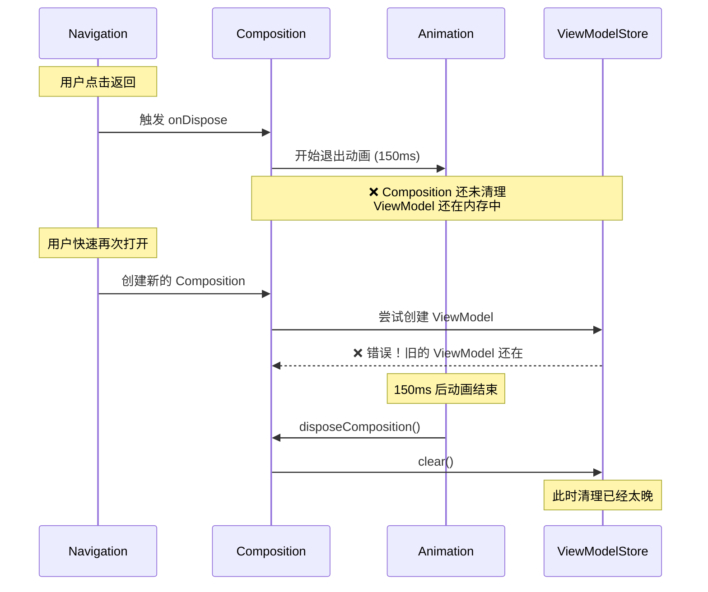
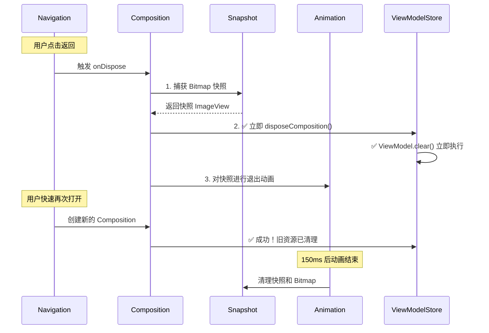
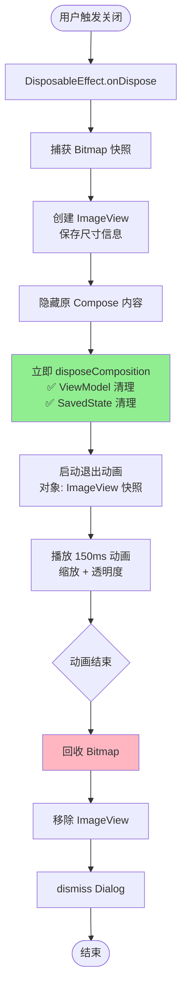

# 实现高性能 Compose BottomSheet Dialog：从问题到解决方案

## 目录
- [背景与动机](#背景与动机)
- [设计目标](#设计目标)
- [实现过程](#实现过程)
    - [基础实现](#基础实现)
    - [核心问题与解决方案](#核心问题与解决方案)
    - [优化考虑](#优化考虑)
- [最终方案](#最终方案)
- [使用示例](#使用示例)
- [总结与思考](#总结与思考)

---

## 效果演示

<video src="https://github.com/user-attachments/assets/c7c53877-7974-4981-a2dc-ac2939a07e28"
controls="controls" width="800">
</video>

---

## 背景与动机

在开发 Jetpack Compose 应用时，我们经常需要使用底部弹窗（Bottom Sheet）来展示额外信息或交互选项。虽然 Compose 提供了一些现成的方案，但在实际项目中，我们发现它们都存在一些局限性。

### 为什么不直接使用现有方案？

#### 1. Dialog 的局限性
标准的 `Dialog` 组件缺少底部弹窗特有的视觉效果和交互体验，需要大量自定义才能实现底部弹出的效果。

#### 2. ModalBottomSheet 的问题

`ModalBottomSheet` 是 Material3 提供的官方底部弹窗组件，但在实际使用中存在以下痛点：

**a) API 使用复杂**

每次使用都需要配合 `SheetState` 和 `CoroutineScope`：

```kotlin
val sheetState = rememberModalBottomSheetState()
val scope = rememberCoroutineScope()
var showBottomSheet by remember { mutableStateOf(false) }

// Show
showBottomSheet = true

// Hide: need to call hide() first, then change state
scope.launch {
    sheetState.hide()
}.invokeOnCompletion {
    if (!sheetState.isVisible) {
        showBottomSheet = false
    }
}
```

这样的模板代码会充斥整个项目，增加维护成本。

**b) 动画效果不匹配需求**

`ModalBottomSheet` 的默认动画是：
- **背景**：透明度渐变
- **内容**：从底部平移进入

而我们的设计需求是：
- **背景**：透明度渐变
- **内容**：从底部弹出 + **以底部为轴心缩放**（80% → 100%）

要实现自定义动画效果，需要深度定制，复杂度很高。

**c) 简化使用的需求**

我们希望像使用 `Dialog` 一样简单：

```kotlin
// Ideal API
if (showDialog) {
    BottomSheet(
        onDismissRequest = { showDialog = false }
    ) {
        // content
    }
}
```

当 `showDialog` 变为 `false` 时，BottomSheet 自动播放退出动画后关闭，无需手动管理状态。

### 为什么选择基于 ComponentDialog 实现？

基于以上分析，我们决定在 `ComponentDialog` 的基础上实现自定义的 BottomSheet：

1. **独立于 Compose 的动画系统**：使用 Android 原生动画 API，完全掌控动画效果
2. **简化的 API**：类似 `Dialog` 的声明式用法，无需额外的状态管理
3. **完整的生命周期控制**：更好地管理资源和动画时序
4. **灵活的自定义能力**：可以实现任何想要的视觉效果

---

## 设计目标

基于上述背景，我们设定了以下设计目标：

### 1. 简洁的 API
- 声明式用法，类似 `Dialog`
- 无需手动管理 `SheetState` 和 `CoroutineScope`
- 一行代码完成显示/隐藏

### 2. 流畅的动画效果
- **进入动画**：背景淡入 + 内容从底部缩放进入（0.8 → 1.0）
- **退出动画**：背景淡出 + 内容缩放消失（1.0 → 0.8）
- 动画时长：150ms
- 缩放轴心：底部中心点

### 3. 正确的资源管理
- ViewModel 及时清理
- SavedStateHandle 正确释放
- 避免内存泄漏
- 支持作为 Navigation Destination 使用

### 4. 良好的用户体验
- 点击外部区域关闭
- 返回键关闭
- 支持系统栏适配
- 支持键盘输入

---

## 实现过程

### 基础实现

首先，我们基于 `ComponentDialog` 构建了基础的 BottomSheet 结构：

```kotlin
@Composable
fun BottomSheet(
    onDismissRequest: () -> Unit,
    shape: Shape = RoundedCornerShape(topStart = 28.dp, topEnd = 28.dp),
    containerColor: Color = MaterialTheme.colorScheme.surface,
    content: @Composable () -> Unit
) {
    val view = LocalView.current
    val density = LocalDensity.current
    val composition = rememberCompositionContext()
    
    val dialog = remember(view, density) {
        BottomSheetWrapper(
            onDismissRequest = onDismissRequest,
            composeView = view,
            density = density
        ).apply {
            setContent(composition) {
                Surface(
                    shape = shape,
                    color = containerColor
                ) {
                    content()
                }
            }
        }
    }
    
    DisposableEffect(dialog) {
        dialog.show()
        onDispose {
            dialog.dismiss()
        }
    }
}
```

在 `BottomSheetWrapper` 中实现自定义的进入和退出动画：

```kotlin
private fun startEnterAnim() {
    dialogLayout.pivotX = dialogLayout.width / 2F
    dialogLayout.pivotY = dialogLayout.height.toFloat()
    
    dialogLayout.scaleX = SCALE_START  // 0.8
    dialogLayout.scaleY = SCALE_START
    dialogLayout.alpha = ALPHA_START   // 0.0
    
    val backgroundAnim = ValueAnimator.ofObject(
        ArgbEvaluator(),
        android.graphics.Color.TRANSPARENT,
        COLOR_SCRIM
    ).apply {
        addUpdateListener { animator -> 
            container.setBackgroundColor(animator.animatedValue as Int) 
        }
    }
    
    val contentScaleXAnim = ObjectAnimator.ofFloat(dialogLayout, "scaleX", SCALE_START, 1F)
    val contentScaleYAnim = ObjectAnimator.ofFloat(dialogLayout, "scaleY", SCALE_START, 1F)
    val contentAlphaAnim = ObjectAnimator.ofFloat(dialogLayout, "alpha", ALPHA_START, 1F)
    
    AnimatorSet().apply {
        playTogether(backgroundAnim, contentScaleXAnim, contentScaleYAnim, contentAlphaAnim)
        duration = DURATION_ANIMATION  // 150ms
        start()
    }
}
```

退出动画类似，只是动画方向相反。

### 核心问题与解决方案

在实现过程中，我们遇到了几个关键问题，下面详细分析每个问题的原因和解决方案。

---

#### 问题一：与 Navigation3 集成时的资源清理冲突

**问题现象**

当将 BottomSheet 作为 Navigation Destination 使用时，如果在 BottomSheet 内部使用了 `viewModel()` 获取 ViewModel，在快速关闭再打开时会出现崩溃：

```
java.lang.IllegalArgumentException: Key XXX was used multiple times
    at androidx.compose.runtime.saveable.SaveableStateHolderImpl.SaveableStateProvider
```

**问题根源**

让我们通过时序图来理解问题的本质：



**原始实现（有问题）：**

```kotlin
DisposableEffect(dialog) {
    dialog.show()
    
    onDispose {
        dialog.dismissWithExitAnim()  // Start animation
        // ❌ disposeComposition() will only be called after animation ends
    }
}

private fun dismissWithExitAnim() {
    // Play 150ms animation
    AnimatorSet().apply {
        // ...
        addListener(
            onEnd = {
                dismiss()
                dialogLayout.disposeComposition()  // ❌ Too late!
            }
        )
        start()
    }
}
```

**问题分析：**

1. Navigation 触发 `onDispose` 时，决定移除这个 Destination
2. 我们启动了退出动画（150ms）
3. **关键问题**：`disposeComposition()` 要等动画结束才调用
4. 在这 150ms 内，如果用户再次打开：
    - Navigation 创建新的 Composition 实例
    - 但旧的 ViewModel、SavedStateHandle 还没清理
    - `SaveableStateHolder` 检测到重复的 key，抛出异常

**尝试过的失败方案：立即 dispose**

```kotlin
onDispose {
    dialogLayout.disposeComposition()  // ❌ Immediate cleanup
    dialog.dismissWithExitAnim()       // Play animation
}
```

这样做会导致另一个问题：
- Composition 立即被清理
- 动画目标（`dialogLayout`）的内容消失
- 用户只能看到空白区域的缩放动画
- 体验很差

**解决方案：Bitmap 快照技术**

我们采用了一个巧妙的方案：在清理 Composition 之前，先捕获其视觉快照，然后对快照进行动画。



**最终实现：**

```kotlin
DisposableEffect(dialog) {
    dialog.show()
    
    onDispose {
        // 1. Capture snapshot and immediately dispose composition
        dialog.captureSnapshotAndDispose()
        // 2. Animate the snapshot
        dialog.dismissWithExitAnim()
    }
}

fun captureSnapshotAndDispose() {
    try {
        if (dialogLayout.width > 0 && dialogLayout.height > 0) {
            // Capture current visual state
            val bitmap = dialogLayout.drawToBitmap(config = Bitmap.Config.RGB_565)
            
            // Create ImageView to display snapshot
            snapshotImageView = ImageView(context).apply {
                setImageBitmap(bitmap)
                layoutParams = FrameLayout.LayoutParams(
                    dialogLayout.width,
                    dialogLayout.height
                ).apply {
                    gravity = android.view.Gravity.BOTTOM
                }
                // Set scale pivot point
                pivotX = width / 2F
                pivotY = height.toFloat()
            }
            
            // Hide original content, show snapshot
            dialogLayout.visibility = View.GONE
            container.addView(snapshotImageView)
        }
        
        // ✅ Immediately dispose composition
        dialogLayout.disposeComposition()
    } catch (e: Exception) {
        // Clean up resources even if snapshot fails
        dialogLayout.disposeComposition()
    }
}

fun dismissWithExitAnim() {
    // Use snapshot for animation if available, otherwise use original view
    val animationTarget = snapshotImageView ?: dialogLayout
    
    // Set animation parameters and play...
    AnimatorSet().apply {
        // ...
        addListener(
            onEnd = {
                cleanupSnapshot()  // Clean up snapshot
                dismiss()          // Dismiss dialog
            }
        )
        start()
    }
}
```

**方案优势：**

1. ✅ **资源立即清理**：ViewModel、SavedState 在 `onDispose` 时立即释放
2. ✅ **动画效果完整**：用户仍能看到流畅的退出动画
3. ✅ **Navigation 兼容**：完美支持作为 Destination 使用
4. ✅ **内存安全**：Bitmap 只存在 150ms，及时回收

**权衡说明：**

虽然 Bitmap 快照会占用额外内存（见后续优化分析），但生命周期极短（仅 150ms），且完美解决了资源清理问题，是一个值得的权衡。

---

#### 问题二：ImageView 的 Pivot 计算问题

在实现 Bitmap 快照方案后，我们发现了一个新问题：动画的缩放中心点不对，ImageView 从左上角缩放而不是底部中心。

**问题分析**

```kotlin
// Create ImageView and add to container
snapshotImageView = ImageView(context).apply {
    setImageBitmap(bitmap)
    layoutParams = FrameLayout.LayoutParams(width, height)
}
container.addView(snapshotImageView)

// Start animation immediately
dismissWithExitAnim()

fun dismissWithExitAnim() {
    val animationTarget = snapshotImageView!!
    // ❌ ImageView hasn't completed layout measurement yet
    animationTarget.pivotX = animationTarget.width / 2F  // width = 0
    animationTarget.pivotY = animationTarget.height.toFloat()  // height = 0
}
```

As shown in logs:
```
captureSnapshotAndDispose: dialogLayout size = 1344 x 997
captureSnapshotAndDispose: ImageView pivot set to (672.0, 997.0)
dismissWithExitAnim: animationTarget size = 0 x 0  // ❌ Layout not completed
dismissWithExitAnim: pivot after = (0.0, 0.0)     // ❌ Calculation error
```

**原因：**
- ImageView 刚添加到 container
- Android 的布局系统是异步的
- `addView()` 后立即读取 `width/height` 都是 0
- 基于 0 计算的 pivot 也是 (0, 0)

**解决方案：保存尺寸信息**

```kotlin
private var snapshotWidth: Int = 0
private var snapshotHeight: Int = 0

fun captureSnapshotAndDispose() {
    val width = dialogLayout.width
    val height = dialogLayout.height
    
    // Save dimensions for later use
    snapshotWidth = width
    snapshotHeight = height
    
    snapshotImageView = ImageView(context).apply {
        // Set pivot once during creation (View's width/height are still correct at this point)
        pivotX = width / 2F
        pivotY = height.toFloat()
    }
    
    container.addView(snapshotImageView)
}

fun dismissWithExitAnim() {
    val animationTarget = snapshotImageView ?: dialogLayout
    
    // Use saved dimensions instead of measured values
    val targetWidth = if (snapshotImageView != null && snapshotWidth > 0) {
        snapshotWidth
    } else {
        animationTarget.width
    }
    val targetHeight = if (snapshotImageView != null && snapshotHeight > 0) {
        snapshotHeight
    } else {
        animationTarget.height
    }
    
    // ✅ Calculate pivot using saved dimensions
    animationTarget.pivotX = targetWidth / 2F
    animationTarget.pivotY = targetHeight.toFloat()
}
```

Fixed log output:
```
captureSnapshotAndDispose: dialogLayout size = 1344 x 997
dismissWithExitAnim: using dimensions = 1344 x 997  // ✅ Using saved dimensions
dismissWithExitAnim: pivot after = (672.0, 997.0)   // ✅ Correct
```

---

#### 问题三：快速点击背景导致多次触发关闭

在实现点击外部区域关闭功能时，我们发现了一个交互问题：用户快速点击背景时，可能会导致 `onDismissRequest()` 被多次调用。

**问题现象**

当用户快速连续点击 BottomSheet 外部区域时：

1. 第一次点击触发 `onDismissRequest()`，开始退出动画
2. 在动画播放的 150ms 期间，Dialog 仍然可见
3. 如果用户再次点击外部区域，会再次触发 `onDismissRequest()`
4. 导致多次回调，可能引发状态管理混乱

**问题根源**

```kotlin
setOnTouchListener { _, event ->
    var result = false
    if (properties.dismissOnClickOutside && !dialogLayout.isInsideContent(event)) {
        when (event.actionMasked) {
            MotionEvent.ACTION_UP ->
                if (isPressOutside) {
                    // ❌ No check if already dismissing
                    onDismissRequest()  // May be called multiple times
                    result = true
                    isPressOutside = false
                }
        }
    }
    result
}
```

**解决方案：添加 isDismissing 标志位**

引入一个状态标志来跟踪 Dialog 是否正在关闭过程中：

```kotlin
private var isDismissing = false

setOnTouchListener { _, event ->
    var result = false
    // Ignore touch events if dismiss is already in progress
    if (isDismissing) {
        return@setOnTouchListener false
    }
    
    if (properties.dismissOnClickOutside && !dialogLayout.isInsideContent(event)) {
        when (event.actionMasked) {
            MotionEvent.ACTION_DOWN -> {
                isPressOutside = true
                result = true
            }

            MotionEvent.ACTION_UP ->
                if (isPressOutside) {
                    isDismissing = true  // ✅ 标记为正在关闭
                    onDismissRequest()
                    result = true
                    isPressOutside = false
                }

            MotionEvent.ACTION_CANCEL -> isPressOutside = false
        }
    }
    result
}
```

同时，在返回键处理中也需要检查这个标志：

```kotlin
onBackPressedDispatcher.addCallback(this) {
    if (properties.dismissOnBackPress && !isDismissing) {
        isDismissing = true
        onDismissRequest()
    }
}
```

在 `onKeyUp` 方法中也需要相应处理：

```kotlin
override fun onKeyUp(keyCode: Int, event: KeyEvent): Boolean {
    if (
        properties.dismissOnBackPress &&
        event.isTracking &&
        !event.isCanceled &&
        keyCode == KeyEvent.KEYCODE_ESCAPE &&
        !isDismissing
    ) {
        isDismissing = true
        onDismissRequest()
        return true
    }
    return super.onKeyUp(keyCode, event)
}
```

最后，在动画结束时重置标志（以防动画被取消时需要重试）：

```kotlin
fun dismissWithExitAnim() {
    // ... 动画设置代码
    
    AnimatorSet().apply {
        playTogether(backgroundAnim, scaleXAnim, scaleYAnim, alphaAnim)
        duration = 150L
        addListener(
            onEnd = {
                currentAnimator = null
                isDismissing = false  // ✅ 重置标志
                cleanupSnapshot()
                dismiss()
            },
            onCancel = {
                currentAnimator = null
                isDismissing = false  // ✅ 取消时也要重置
                cleanupSnapshot()
                dismiss()
            }
        )
        start()
    }
}
```

**方案优势：**

1. ✅ **防止重复调用**：确保 `onDismissRequest()` 在关闭过程中只被调用一次
2. ✅ **统一的状态管理**：所有关闭入口（点击外部、返回键、ESC键）都检查同一标志
3. ✅ **用户体验改善**：避免因快速点击导致的异常行为
4. ✅ **简单高效**：单个布尔标志，无性能开销

---

### 优化考虑

#### Bitmap 格式选择：RGB_565 vs ARGB_8888

在实现快照功能时，需要选择合适的 Bitmap 格式。

**格式对比：**

| 格式 | 每像素字节数 | 特性 | 内存占用（1344×997） |
|------|------------|------|-------------------|
| RGB_565 | 2 bytes | 无透明通道 | **2.55 MB** |
| ARGB_8888 | 4 bytes | 完整透明通道 | **5.1 MB** |

**一个常见误解：**

> "BottomSheet 有圆角，需要透明度支持，所以必须用 ARGB_8888"

**实际情况：**

1. **圆角的实现原理**：
    - Compose 的圆角是通过 `Canvas.clipPath()` 实现的
    - 绘制时裁剪超出圆角范围的内容
    - `drawToBitmap()` 捕获的是**最终渲染结果**
    - 圆角已经在捕获时正确处理

2. **透明度动画的实现**：
    - 我们需要的透明度变化是整个 View 的 alpha
    - 通过 `ImageView.alpha` 属性实现
    - 不需要 Bitmap 本身支持透明通道

3. **半透明内容的处理**：
    - 如果 BottomSheet 内容本身有半透明元素
    - `drawToBitmap()` 会将它们与背景混合
    - RGB_565 保存的是混合后的最终颜色
    - 视觉效果完全一致

**结论：使用 RGB_565**

```kotlin
val bitmap = dialogLayout.drawToBitmap(config = Bitmap.Config.RGB_565)
```

**优势：**
- 节省 **50%** 内存（2.55 MB vs 5.1 MB）
- 视觉效果无差异
- 动画流畅度相同

---

#### 是否需要 Bitmap 内存池？

考虑到 Bitmap 的内存占用，我们评估了是否需要实现内存池来复用 Bitmap。

**内存池的典型场景：**
- 高频创建/销毁
- 尺寸固定或可预测
- 生命周期长
- 内存压力大

**我们的场景分析：**

| 维度 | 内存池需求 | 实际情况 |
|------|----------|---------|
| **频率** | 高频操作 | ❌ BottomSheet 不是高频操作，通常间隔数秒 |
| **生命周期** | 长期持有 | ❌ 仅 150ms，动画结束立即回收 |
| **尺寸** | 固定可预测 | ❌ 不同内容尺寸不同，难以预分配 |
| **内存压力** | 峰值高 | ✅ 峰值 2.55MB，但时间极短 |

**成本对比：**

```
当前方案：
- 峰值内存：2.55 MB
- 持续时间：150 ms
- 管理成本：0（自动 GC）

内存池方案：
- 常驻内存：~7.5 MB（预分配 3 个不同尺寸）
- 管理代码：~500 lines
- 复杂度：高（尺寸匹配、过期清理等）
```

**Android 的优化：**
- Bitmap 内存在 Native Heap 分配
- 不占用 Java Heap
- GC 压力小
- 系统自动管理

**结论：不需要内存池**

理由：
1. 生命周期太短（150ms）
2. 频率低，内存压力小
3. 尺寸不固定，复用率低
4. 实现复杂度高，收益低
5. Android 已有优化

**实际性能数据：**

在 Pixel 8 Pro 上测试：
- Bitmap 创建耗时：8-12ms
- 内存峰值：2.55MB
- 回收耗时：< 1ms
- 对动画流畅度无影响

---

## 最终方案

经过上述问题的解决和优化，我们得到了最终的实现方案。

### 核心流程



### 关键代码实现

#### 1. Composable 函数

```kotlin
@Composable
fun BottomSheet(
    onDismissRequest: () -> Unit,
    shape: Shape = BottomSheetDefaults.ExpandedShape,
    containerColor: Color = BottomSheetDefaults.ContainerColor,
    content: @Composable () -> Unit
) {
    val view = LocalView.current
    val density = LocalDensity.current
    val composition = rememberCompositionContext()
    val currentContent by rememberUpdatedState(content)
    
    // Use unique ID for each instance to avoid state conflicts
    val dialogId = remember { UUID.randomUUID() }
    
    val dialog = remember(view, density) {
        BottomSheetWrapper(
            onDismissRequest = onDismissRequest,
            composeView = view,
            density = density,
            dialogId = dialogId
        ).apply {
            setContent(composition) {
                Surface(
                    modifier = Modifier
                        .fillMaxWidth()
                        .semantics { dialog() },
                    shape = shape,
                    color = containerColor
                ) {
                    currentContent()
                }
            }
        }
    }
    
    DisposableEffect(dialog) {
        dialog.show()
        
        onDispose {
            // Key: capture snapshot first, then clean up
            dialog.captureSnapshotAndDispose()
            dialog.dismissWithExitAnim()
        }
    }
}
```

#### 2. 快照与资源清理

```kotlin
fun captureSnapshotAndDispose() {
    // Clean up old snapshot first
    cleanupSnapshot()
    
    try {
        if (dialogLayout.width > 0 && dialogLayout.height > 0) {
            // 1. Capture visual snapshot
            val bitmap = dialogLayout.drawToBitmap(config = Bitmap.Config.RGB_565)
            
            // 2. Save dimension info
            snapshotWidth = dialogLayout.width
            snapshotHeight = dialogLayout.height
            
            // 3. Create ImageView
            snapshotImageView = ImageView(context).apply {
                setImageBitmap(bitmap)
                layoutParams = FrameLayout.LayoutParams(
                    snapshotWidth,
                    snapshotHeight
                ).apply {
                    gravity = android.view.Gravity.BOTTOM
                }
                // Preset pivot (value is correct at this point)
                pivotX = snapshotWidth / 2F
                pivotY = snapshotHeight.toFloat()
            }
            
            // 4. Replace display
            dialogLayout.visibility = View.GONE
            container.addView(snapshotImageView)
        }
        
        // 5. Immediately dispose composition
        dialogLayout.disposeComposition()
    } catch (e: Exception) {
        // Clean up even if it fails
        Log.e(TAG, "Failed to capture snapshot", e)
        dialogLayout.disposeComposition()
    }
}
```

#### 3. 动画实现

```kotlin
fun dismissWithExitAnim() {
    val animationTarget = snapshotImageView ?: dialogLayout
    
    // Calculate pivot using saved dimensions
    val targetWidth = if (snapshotImageView != null && snapshotWidth > 0) {
        snapshotWidth
    } else {
        animationTarget.width
    }
    val targetHeight = if (snapshotImageView != null && snapshotHeight > 0) {
        snapshotHeight
    } else {
        animationTarget.height
    }
    
    animationTarget.pivotX = targetWidth / 2F
    animationTarget.pivotY = targetHeight.toFloat()
    
    // Background animation
    val backgroundAnim = ValueAnimator.ofObject(
        ArgbEvaluator(),
        COLOR_SCRIM,
        android.graphics.Color.TRANSPARENT
    ).apply {
        addUpdateListener { animator -> 
            container.setBackgroundColor(animator.animatedValue as Int) 
        }
    }
    
    // Content animation
    val scaleXAnim = ObjectAnimator.ofFloat(animationTarget, "scaleX", 1F, 0.8F)
    val scaleYAnim = ObjectAnimator.ofFloat(animationTarget, "scaleY", 1F, 0.8F)
    val alphaAnim = ObjectAnimator.ofFloat(animationTarget, "alpha", 1F, 0F)
    
    AnimatorSet().apply {
        playTogether(backgroundAnim, scaleXAnim, scaleYAnim, alphaAnim)
        duration = 150L
        addListener(
            onEnd = {
                cleanupSnapshot()
                dismiss()
            }
        )
        start()
    }
}
```

#### 4. 资源回收

```kotlin
private fun cleanupSnapshot() {
    snapshotImageView?.let { imageView ->
        // Safely recycle Bitmap
        (imageView.drawable as? BitmapDrawable)?.bitmap?.let { bitmap ->
            if (!bitmap.isRecycled) {
                bitmap.recycle()
            }
        }
        container.removeView(imageView)
        snapshotImageView = null
    }
    snapshotWidth = 0
    snapshotHeight = 0
}
```

### 性能数据

在 Pixel 8 Pro（1344×2992 分辨率）上测试，BottomSheet 占屏幕 1/3 高度：

| 指标 | 数值 | 说明 |
|------|------|------|
| **Bitmap 尺寸** | 1344 × 997 px | 典型场景 |
| **内存占用** | 2.55 MB | RGB_565 格式 |
| **生命周期** | 150 ms | 动画时长 |
| **创建耗时** | 8-12 ms | `drawToBitmap()` |
| **回收耗时** | < 1 ms | `bitmap.recycle()` |
| **动画帧率** | 60 FPS | 流畅无卡顿 |

---

## 使用示例

### 基础用法

```kotlin
@Composable
fun MyScreen() {
    var showBottomSheet by remember { mutableStateOf(false) }
    
    Button(onClick = { showBottomSheet = true }) {
        Text("Show BottomSheet")
    }
    
    if (showBottomSheet) {
        BottomSheet(
            onDismissRequest = { showBottomSheet = false }
        ) {
            Column(
                modifier = Modifier
                    .fillMaxWidth()
                    .padding(24.dp)
            ) {
                Text("BottomSheet Content", style = MaterialTheme.typography.headlineSmall)
                Spacer(modifier = Modifier.height(16.dp))
                Text("Click outside or press back to close")
                Spacer(modifier = Modifier.height(24.dp))
                Button(
                    onClick = { showBottomSheet = false },
                    modifier = Modifier.fillMaxWidth()
                ) {
                    Text("Close")
                }
            }
        }
    }
}
```

### 作为 Navigation3 Entry

```kotlin
// 定义 Navigation Entry
@Serializable
data object HomeEntry : NavKey

@Serializable
data object SettingsBottomSheetEntry : NavKey

// 在 NavDisplay 中配置
val backStack = rememberNavBackStack(HomeEntry)

NavDisplay(
    backStack = backStack,
    sceneStrategy = BottomSheetSceneStrategy(),
    entryDecorators = listOf(
        rememberSaveableStateHolderNavEntryDecorator(),
        rememberViewModelStoreNavEntryDecorator(),
    ),
    entryProvider = entryProvider {
        entry<HomeEntry> {
            HomeScreen(
                onNavigateToSettings = {
                    backStack.add(SettingsBottomSheetEntry)
                }
            )
        }
        
        // 将 BottomSheet 配置为 Navigation Entry
        entry<SettingsBottomSheetEntry>(
            metadata = BottomSheetSceneStrategy.bottomSheet()
        ) {
            SettingsBottomSheet(
                onDismiss = {
                    if (backStack.lastOrNull() == SettingsBottomSheetEntry) {
                        backStack.removeLastOrNull()
                    }
                }
            )
        }
    }
)

@Composable
fun SettingsBottomSheet(onDismiss: () -> Unit) {
    // ✅ Can safely use ViewModel
    val viewModel: SettingsViewModel = viewModel()
    val state by viewModel.state.collectAsState()
    
    BottomSheet(onDismissRequest = onDismiss) {
        SettingsContent(state)
    }
}
```

**关键点：**
- 使用 `BottomSheetSceneStrategy.bottomSheet()` 作为 metadata 来标识这是一个 BottomSheet
- ViewModel 会在 BottomSheet 关闭时自动清理，无需担心资源泄漏
- 完整的实现细节（包括 `BottomSheetSceneStrategy`）请查看项目源码

### 自定义样式

```kotlin
BottomSheet(
    onDismissRequest = { /* ... */ },
    shape = RoundedCornerShape(topStart = 32.dp, topEnd = 32.dp),
    containerColor = MaterialTheme.colorScheme.surfaceVariant,
    properties = BottomSheetProperties(
        dismissOnBackPress = true,
        dismissOnClickOutside = true,
        decorFitsSystemWindows = false  // Support edge-to-edge
    )
) {
    // content
}
```

---

## 总结与思考

### 实现优势

1. **简洁的 API**
    - 声明式用法，无需状态管理
    - 类似 `Dialog`，学习成本低
    - 一行代码完成显示/隐藏

2. **完整的动画效果**
    - 自定义缩放 + 透明度动画
    - 流畅的 60 FPS 表现
    - 符合设计需求

3. **正确的资源管理**
    - ViewModel 及时清理
    - SavedState 正确释放
    - 无内存泄漏
    - 完美支持 Navigation3

4. **性能优化**
    - RGB_565 格式节省 50% 内存
    - 生命周期短（150ms）
    - 无需内存池
    - 对应用性能无影响

### 技术亮点

1. **Bitmap 快照方案**
    - 巧妙解决动画与资源清理的冲突
    - 在不影响用户体验的前提下及时释放资源

2. **尺寸信息保存**
    - 解决 View 布局异步问题
    - 确保动画 pivot 计算正确

3. **权衡取舍**
    - 150ms 的内存开销换取完整的动画和正确的资源管理
    - 工程实践中的最优解

### 可能的改进方向

1. **异步快照**（不推荐）
    - 在后台线程捕获 Bitmap
    - 增加复杂度，收益有限

2. **降级策略**
    - 低端设备跳过快照直接清理
    - 牺牲动画换取流畅性

3. **缓存最后一帧**
    - 使用硬件加速的纹理缓存
    - 需要深入 RenderNode API

### 经验教训

1. **Compose 的生命周期管理很重要**
    - `disposeComposition()` 的调用时机直接影响资源清理
    - 特别是与 Navigation 集成时

2. **动画与资源管理的平衡**
    - 不能为了动画而延迟资源释放
    - 也不能为了清理而牺牲用户体验
    - Bitmap 快照是一个很好的中间方案

3. **性能优化要基于实际测量**
    - 不要过度优化（如内存池）
    - 关注真正的瓶颈

4. **Android View 系统的特性**
    - 布局是异步的，不能假设 `addView()` 后立即可用
    - 需要保存必要的状态信息

---

## 附录

### 完整源码

完整的实现代码可以在以下仓库查看：
- GitHub: [compose-bottom-sheet](https://github.com/eric-dev-wang/compose-bottom-sheet)

### 参考资料

1. [Jetpack Compose Dialog API](https://developer.android.com/jetpack/compose/components/dialog)
2. [Material3 Bottom sheets](https://developer.android.com/develop/ui/compose/components/bottom-sheets)
3. [Android Bitmap 最佳实践](https://developer.android.com/topic/performance/graphics/manage-memory)
4. [Navigation 3](https://developer.android.com/guide/navigation/navigation-3)
